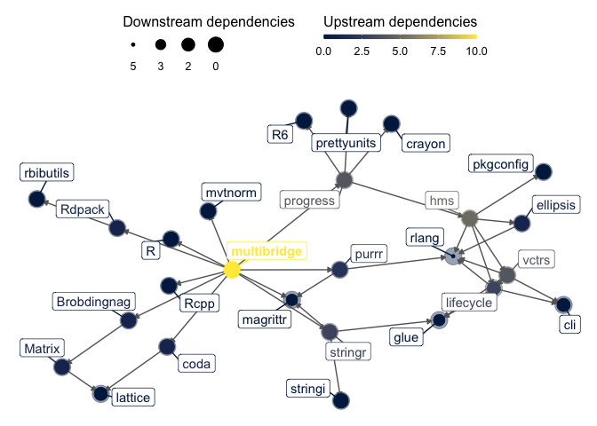

<!-- README.md is generated from README.Rmd. Please edit that file -->

# multibridge: Evaluating Multinomial Order Restrictions with Bridge Sampling

<!-- badges: start -->

[](https://cran.r-project.org/package=multibridge)
[](https://www.repostatus.org/#active)


[](https://codecov.io/gh/ASarafoglou/multibridge)
[](https://github.com/ASarafoglou/multibridge/issues?q=is%3Aopen+is%3Aissue+label%3Abug)
<!-- badges: end -->

Evaluates hypotheses concerning the distribution of multinomial
proportions using bridge sampling. The bridge sampling routine is able
to compute Bayes factors for hypotheses that entail inequality
constraints, equality constraints, free parameters, and a mix of all
three. These hypotheses are tested against the encompassing hypothesis,
that all parameters vary freely.

## Installation

System requirement is the library `mpfr` with a version bigger than
`3.0.0`. To install `mpfr`, you need a C compiler, preferably GCC.
Detailed information on how to install `mpfr` are available at
<https://www.mpfr.org/mpfr-current/mpfr.html>.

On Mac you can install `mpfr` through the Terminal (assuming that `brew`
is installed on your machine).

``` bash
brew install mpfr
```

On Debian or Ubuntu you can install `mpfr` through the Terminal:

``` bash
sudo apt-get install libmpfr-dev
```

You can install the released version of `multibridge` from
[CRAN](https://CRAN.R-project.org) with:

``` r
install.packages("multibridge")
```

And the development version from [GitHub](https://github.com/) with:

``` r
# install.packages("remotes")
remotes::install_github("ASarafoglou/multibridge")
```

## Example

This is a basic example which shows you how to solve a common problem:

``` r
library("multibridge")
# data
x <- c(3, 4, 10, 11, 7, 30)
# priors
a <- c(1, 1, 1, 1, 1, 1)
# category labels
factor_levels <- c('theta1', 'theta2', 
                   'theta3', 'theta4', 
                   'theta5', 'theta6')
# constrained hypothesis
Hr            <- c('theta1', '<',  'theta2', '&', 
                   'theta3', '=', 'theta4', ',', 
                   'theta5', '<', 'theta6')
output <- mult_bf_informed(x, Hr, a, factor_levels, seed=2020, niter=2e3)

m1 <- summary(output)
m1
#> Bayes factor analysis
#> 
#>  Hypothesis H_e:
#>  All parameters are free to vary.
#> 
#>  Hypothesis H_r:
#>  theta1 < theta2 & theta3 = theta4 , theta5 < theta6 
#> 
#> Bayes factor estimate LogBFer:
#> 
#> -2.4239
#> 
#> Based on 1 independent equality-constrained hypothesis
#>  and 2 independent inequality-constrained hypotheses. 
#> 
#> Relative Mean-Square Error:
#> 
#> 6.29e-05
#> 
#> Posterior Median and Credible Intervals Of Marginal Beta Distributions:
#>           alpha   beta   2.5%    50% 97.5%
#> 1 theta1 1 + 3  5 + 62 0.0158 0.0522 0.120
#> 2 theta2 1 + 4  5 + 61 0.0236 0.0664 0.140
#> 3 theta3 1 + 10 5 + 55 0.0811 0.1520 0.247
#> 4 theta4 1 + 11 5 + 54 0.0918 0.1660 0.264
#> 5 theta5 1 + 7  5 + 58 0.0507 0.1090 0.195
#> 6 theta6 1 + 30 5 + 35 0.3240 0.4360 0.553
```

## Package dependencies


